# Visonic Themes for Typora

> Visonic 主题系列 — 一套为 Typora 打造的霓虹动画主题全家桶，**13 款主题**覆盖全天候使用场景。

## 系列总览

### Egoism · 液态光影（6 款）

| 主题名称 | CSS 文件 | 风格 | 色调 | 预览 |
|----------|----------|------|------|------|
| Visonic Egoism - Fancy | `visonic-egoism-fancy.css` | 暖焰流光 | 暖橙 | 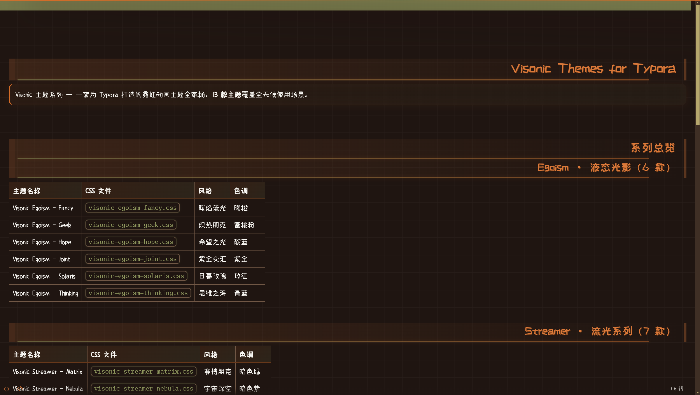 |
| Visonic Egoism - Geek | `visonic-egoism-geek.css` | 炽热朋克 | 蜜桃粉 | 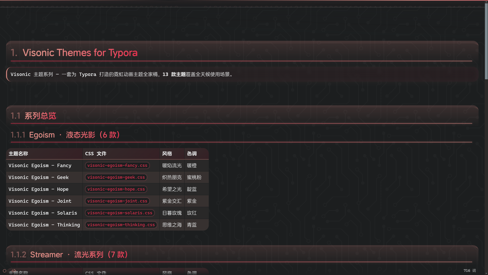 |
| Visonic Egoism - Hope | `visonic-egoism-hope.css` | 希望之光 | 靛蓝 | 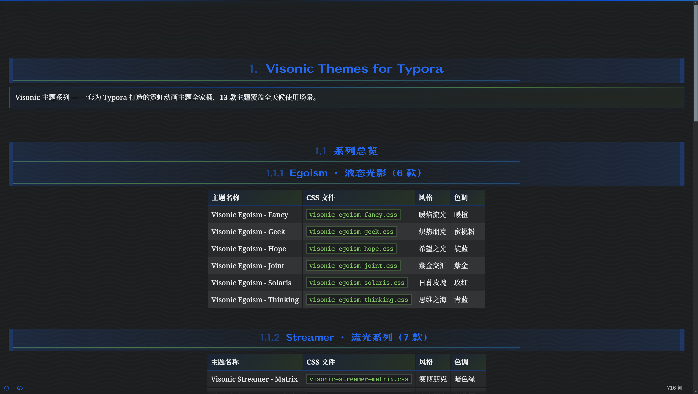 |
| Visonic Egoism - Joint | `visonic-egoism-joint.css` | 紫金交汇 | 紫金 | 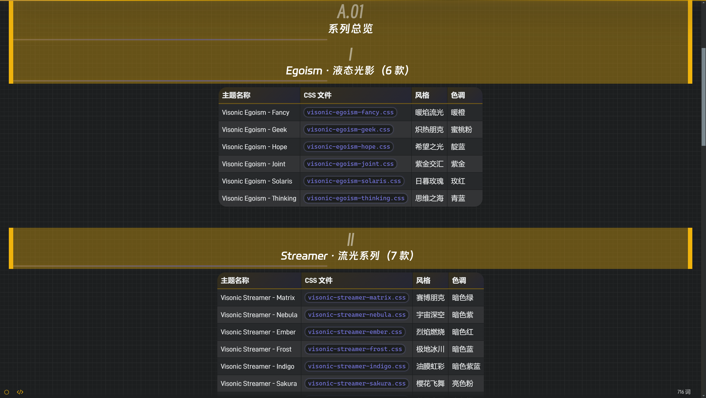 |
| Visonic Egoism - Solaris | `visonic-egoism-solaris.css` | 日暮玫瑰 | 玫红 | 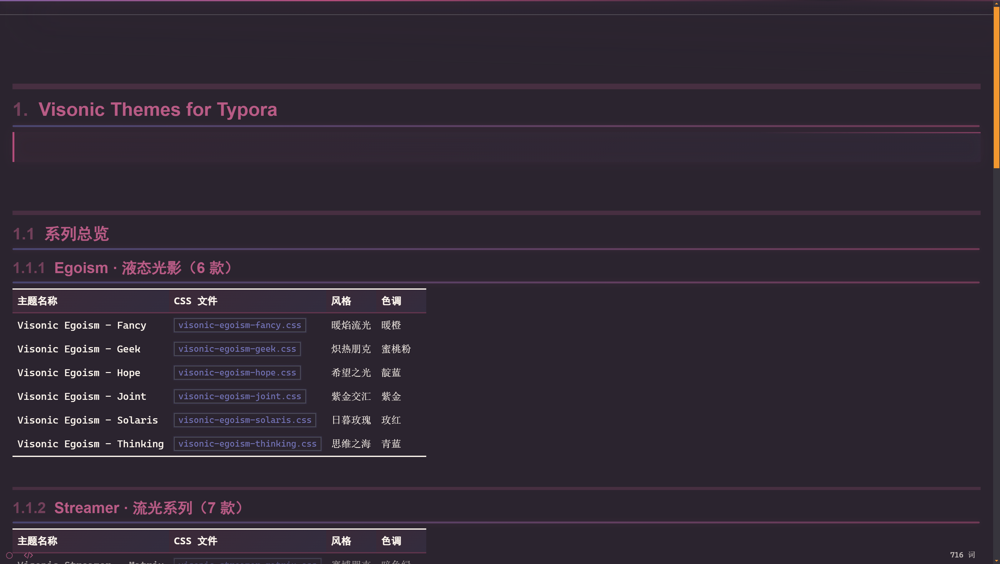 |
| Visonic Egoism - Thinking | `visonic-egoism-thinking.css` | 思维之海 | 青蓝 | 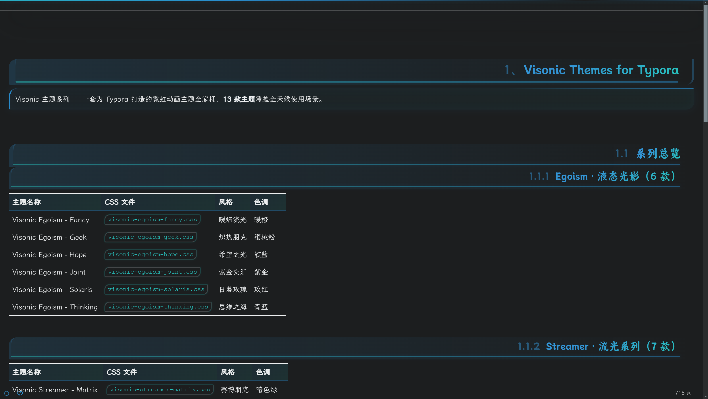 |

### Streamer · 流光系列（7 款）

| 主题名称 | CSS 文件 | 风格 | 色调 | 预览 |
|----------|----------|------|------|------|
| Visonic Streamer - Matrix | `visonic-streamer-matrix.css` | 赛博朋克 / 霓虹光效 | 暗色绿 | 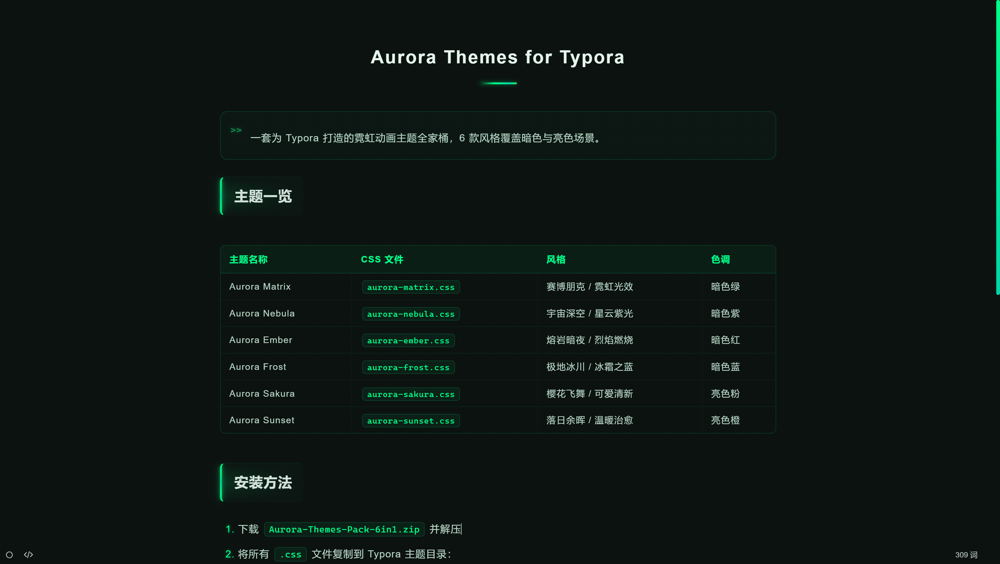 |
| Visonic Streamer - Nebula | `visonic-streamer-nebula.css` | 宇宙深空 / 星云紫光 | 暗色紫 | 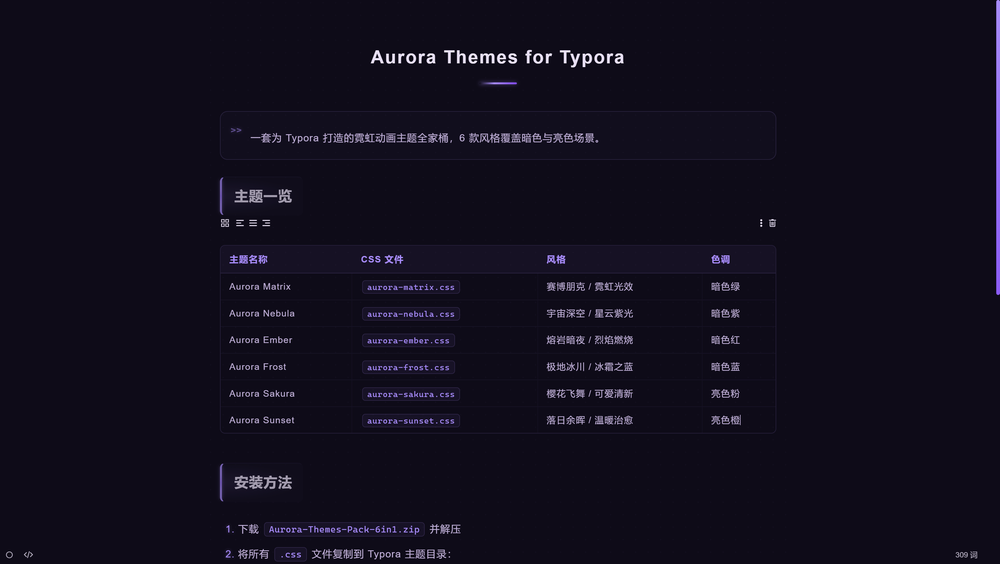 |
| Visonic Streamer - Ember | `visonic-streamer-ember.css` | 熔岩暗夜 / 烈焰燃烧 | 暗色红 | 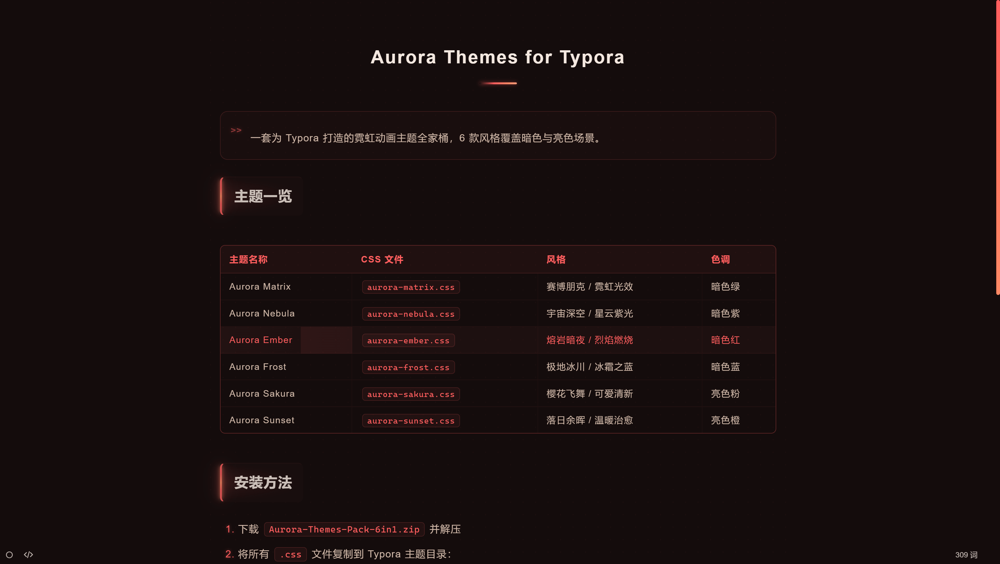 |
| Visonic Streamer - Frost | `visonic-streamer-frost.css` | 极地冰川 / 冰霜之蓝 | 暗色蓝 | 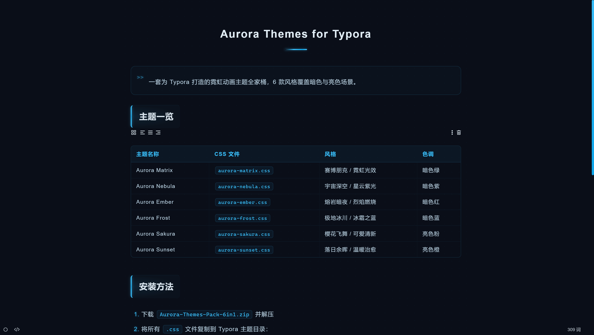 |
| Visonic Streamer - Indigo | `visonic-streamer-indigo.css` | 液体靛蓝 / 油膜虹彩 | 暗色紫蓝 | 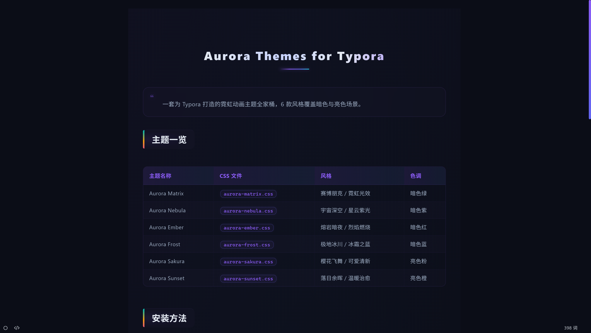 |
| Visonic Streamer - Sakura | `visonic-streamer-sakura.css` | 樱花飞舞 / 可爱清新 | 亮色粉 | 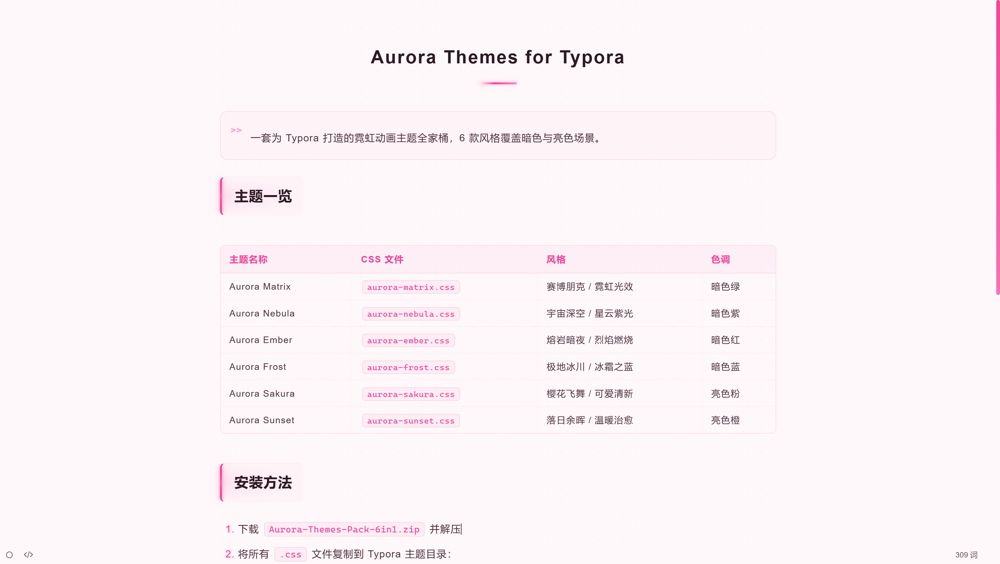 |
| Visonic Streamer - Sunset | `visonic-streamer-sunset.css` | 落日余晖 / 温暖治愈 | 亮色橙 | 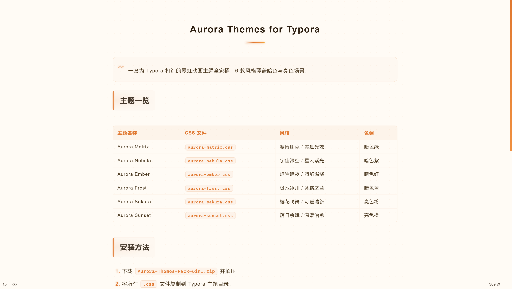 |

## 安装方法

### 一键安装（Windows 推荐）

1. 下载完整仓库或 Release 压缩包并解压。
2. 双击运行 `install-windows.bat`（或 `一键安装主题.bat`）。
3. 重启 Typora，在「主题」菜单中选择 Visonic 主题。

脚本会自动复制 `themes/` 下的 13 个主题文件，并同步 `visonic-fonts/` 字体依赖到 Typora 主题目录。

### 手动安装

#### 步骤 1：复制字体依赖（Egoism 系列必须）

将 `visonic-fonts/` 文件夹复制到 Typora 主题目录下：

**Windows**: `C:\Users\<用户名>\AppData\Roaming\Typora\themes\visonic-fonts\`

#### 步骤 2：安装主题

将 `themes/` 目录下的 13 个 `visonic-*.css` 文件复制到 Typora 主题目录：

**Windows**: `C:\Users\<用户名>\AppData\Roaming\Typora\themes\`

#### 步骤 3：重启 Typora

重启后在 `主题` 菜单中选择对应主题即可。

> **提示**: `visonic-egoism-*.css` 需要 `visonic-fonts` 字体依赖才能正常渲染。`visonic-streamer-*.css` 为独立主题，无需额外依赖。

## 特性

### Egoism 系列 — 液态光影
- **21+ 动画效果**：全局流动背景、四角流光、标题下划线光折射、代码块旋转光边框、代码光泽掠过、链接光轨、引用框扫描线、分割线流光、图片光边框、列表脉冲标记、TOC 滑动光边、页面顶部流光条、液态滚动条、选区光效、元数据呼吸、光粒子漂浮等
- **基于 VLOOK 架构**：完整继承 VLOOK 主题体系的字体、多语言、代码高亮
- **亮色 / 暗色**：每款主题自动适配昼夜模式

### Streamer 系列 — 流光霓虹
- **12 ~ 30 动画效果**：H1 流光扫过下划线、H2 霓虹灯条呼吸、H3 菱形旋转装饰、代码块扫描灯条、呼吸灯、Shimmer 光扫等
- **暗色 5 款 + 亮色 2 款**：覆盖全天候使用场景
- **Indigo 特别版**：30 个液体光影关键帧动画、虹彩渐变、玻璃拟态引用块、极光代码块灯条、液态金属标题

## 目录结构

```
Visonic-Themes/
├── LICENSE
├── README.md
├── install-windows.bat             # Windows 一键安装脚本
├── 一键安装主题.bat                 # 中文文件名安装脚本
├── themes/                         # 13 个主题（平铺）
│   ├── visonic-egoism-fancy.css
│   ├── visonic-egoism-geek.css
│   ├── visonic-egoism-hope.css
│   ├── visonic-egoism-joint.css
│   ├── visonic-egoism-solaris.css
│   ├── visonic-egoism-thinking.css
│   ├── visonic-streamer-ember.css
│   ├── visonic-streamer-frost.css
│   ├── visonic-streamer-indigo.css
│   ├── visonic-streamer-matrix.css
│   ├── visonic-streamer-nebula.css
│   ├── visonic-streamer-sakura.css
│   └── visonic-streamer-sunset.css
└── visonic-fonts/                  # 字体依赖（Egoism 系列需要）
    ├── github-io/
    ├── pages-dev/
    └── lang/
```

## 许可

本项目基于 MIT 协议发布，可以自由使用、修改和分发。
